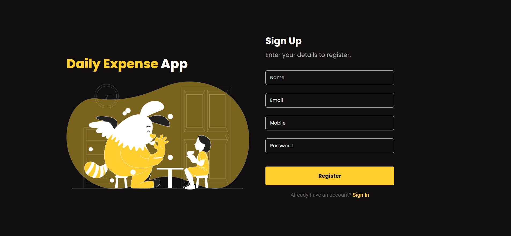
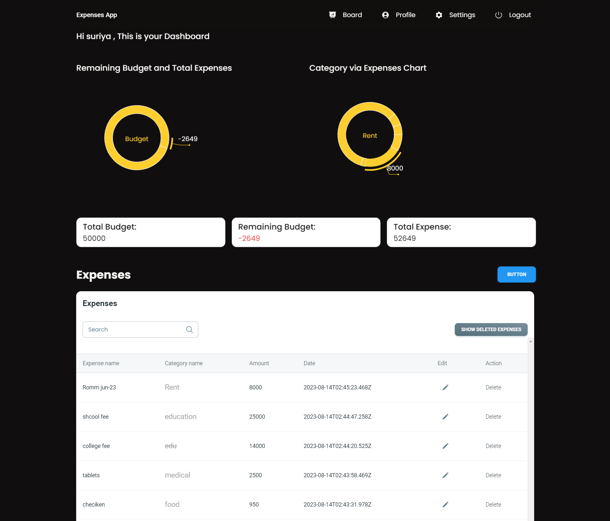

# expenses-app

### Step 1: Clone the Repository
1. Run the command: git clone https://github.com/Suriya2596/expenses-app.

### Step 2: Setting Up the Backend
1. Open the project in Visual Studio.
2. Open the terminal.
3. Navigate to the 'backend' directory using the command: cd backend.
4. Install the required packages by running: npm install.
5. Create a .env file and set the JWT_SECRET with any value.
6. Start the server by running: nodemon index.js.

### Step 3: Setting Up the Frontend
1. Open the project in Visual Studio.
2. Open the terminal.
3. Navigate to the 'client' directory using the command: cd client.
4. Install the necessary packages by running: npm install.
5. Launch the front end by running: npm start.

### Step 4: Registration and Login
1. After launching the application, register using your details.
2. Login with your credentials to start using the application.

## Feel free to follow these steps to successfully set up and use the Expenses App.

## Sample Image

